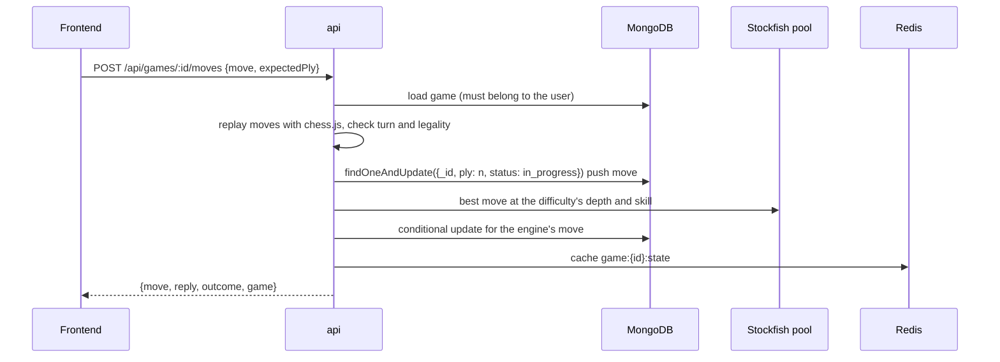
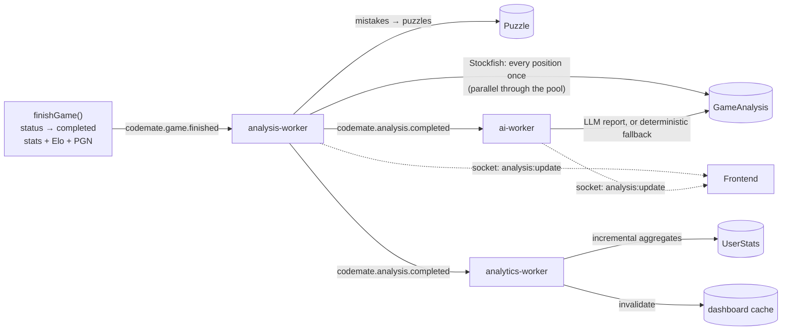

# CodeMate Data Flows

## 1. A move in an AI game (synchronous)

If the conditional update matches nothing (a double click, or two tabs), the second request gets `409 CONCURRENT_MOVE`.

## 2. A move in an online game (real time)

1. The client emits `game:move {gameId, move, clientMoveId, expectedPly}`.
2. The gateway runs `SET move:{gameId}:{clientMoveId} NX`. If the key exists, it replies `duplicate: true` with the current state.
3. `games.applyMove` runs, the same authoritative code as the REST API: clock deduction, legality, the conditional write, outcome detection.
4. The gateway broadcasts `game:state` to the `game:{id}` room. With Redis, that reaches every realtime instance through the adapter. On game over it also emits `game:finish`.
5. The clock deadline is stored in the `clock:deadlines` sorted set. The sweeper ends the game on flag fall even if nobody moves.

## 3. A finished game (asynchronous pipeline, spec §28)

The frontend shows the pipeline status (game saved → engine analysis → AI report) by polling `GET /api/games/:id/analysis`, and updates early when an `analysis:update` socket event arrives.

## 4. A code submission (asynchronous, spec §30)

1. `POST /api/coding/submissions` creates a `Submission { status: queued }`, publishes `codemate.code.submitted`, and returns `202`.
2. The coding worker claims it atomically (`queued → running`), runs the tests in Judge0 with limited concurrency, and stores the results. Hidden tests are stored without their input or expected output.
3. The first accepted submission for a problem increments `problemsSolved` and earns a **hint credit**.
4. The worker publishes `codemate.code.completed` (the analytics worker invalidates the dashboard) and pushes `submission:update` to the user's sockets. The frontend also polls.

## 5. An AI question about a game (Game RAG, spec §13)

`POST /api/games/:id/chat`:

1. The intent router (rules) decides between `game`, `chess` and `mixed`.
2. The game context builder picks the relevant moves: mentioned move numbers or SAN moves, the selected ply, the biggest drop in winning chances, mistakes, themed moves. It formats them as Stockfish facts.
3. It adds the player's history if the question asks about patterns.
4. It retrieves knowledge: corpus documents mapped from the moves' themes (plus hybrid chess RAG when the route is `mixed`).
5. The prompt template goes to the LLM gateway (medium tier), which returns JSON validated with zod.
6. The grounding check runs. If the answer invents an evaluation, it's discarded in favour of the deterministic answer.
7. The exchange is saved in `ChatThread`, and `codemate.ai.chat.completed` is published for analytics.

## 6. Where each kind of data lives

| Data | Store | Lifetime |
| :-- | :-- | :-- |
| Users, games, analyses, puzzles, submissions, rating history, chat threads | MongoDB | Durable |
| Knowledge chunks, text and embeddings (the manifest) | MongoDB | Rebuilt by `npm run ingest` |
| Knowledge vectors | Qdrant, or rebuilt in memory from MongoDB at startup | Derived |
| `game:{id}:state`, `user:{id}:presence`, `mm:*` queues, `clock:deadlines`, `ratelimit:*`, `dashboard:{id}`, `leaderboard:{period}`, `ai:response:*` | Redis | TTL-based, rebuildable |
| Domain events | Kafka (7-day retention) | Transient |
