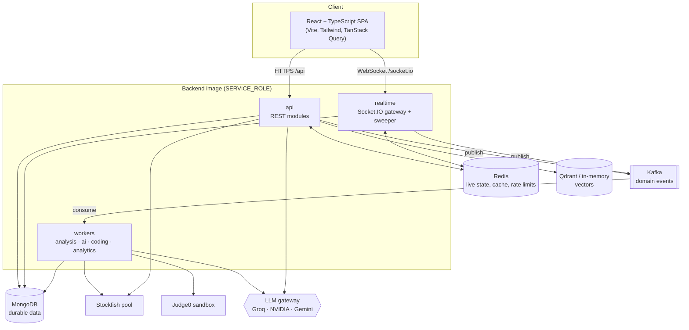

# CodeMate Architecture Overview

CodeMate is a chess + coding learning platform: play chess (against Stockfish, locally, or online), have every game analysed by Stockfish, talk to an AI coach grounded in that analysis and in a chess knowledge corpus, practise positions built from your own mistakes, and solve coding problems that earn engine hints.

It is a **modular monolith** that runs as one process in development and as separate roles in production (see [service-boundaries.md](./service-boundaries.md)). Every piece of infrastructure beyond MongoDB is optional: without it, an in-process implementation takes over, so `npm run dev` works on a laptop with only MongoDB.

## Big picture

## Modules (`backend/src/modules`)

| Module | Responsibility | Key files |
| :-- | :-- | :-- |
| `auth` | Register, login, refresh rotation, logout, JWT helpers | `auth.controller.js`, `tokens.js` |
| `users` | Profile, preferences, statistics, rating history | `users.routes.js` |
| `admin` | Admin accounts, coding question management | `admin.*` |
| `games` | Authoritative chess games (AI, local, online), clocks, hints, PGN | `game.service.js`, `online.service.js` |
| `chess` | Opening classification, debug engine endpoint | `openings.js` |
| `ratings` | Elo and rating history | `elo.js` |
| `analysis` | Structured Stockfish analysis per move | `analysis.service.js` |
| `matchmaking` | Queues on Redis sorted sets | `matchmaking.service.js` |
| `learning` | Puzzles made from mistakes | `puzzle.service.js` |
| `ai` | Game RAG, Chess RAG, explain-move, coach, prompts, grounding | `ai.service.js`, `rag/*`, `coach.service.js` |
| `coding` | Problems, async submissions, Judge0 | `coding.service.js` |
| `analytics` | Dashboard, statistics, leaderboards, aggregates | `analytics.service.js` |

Infrastructure adapters (`backend/src/infrastructure`): `mongodb`, `redis` (Redis or in-memory), `kafka` (Kafka or in-process bus), `stockfish` (UCI engine pool), `judge0`, `llm` (provider gateway), `embeddings` (local or remote), `vector` (Qdrant or in-memory), `metrics` (Prometheus), `logger` (pino).

## Why each technology is here (spec §2, §51)

| Technology | Used for | Why this and not something else |
| :-- | :-- | :-- |
| MongoDB | Users, games, analyses, submissions, puzzles, chat threads, knowledge manifest | The durable source of truth; documents match the game and analysis shapes |
| Redis | Live game state, presence, matchmaking queues, rate-limit counters, dashboard and AI caches, Socket.IO adapter | Ephemeral, hot, shared across instances. Never the only copy of a finished game. |
| Kafka | `game.finished` → analysis → AI report → analytics; async code judging | Work that shouldn't block the request and must survive restarts. Not used for synchronous CRUD. |
| Socket.IO | Online play, presence, push notifications | Bidirectional, reconnects, rooms; Redis adapter for multiple instances |
| Stockfish | Bot moves, hints, full-game analysis, puzzle checking | Deterministic engine facts the LLM is never allowed to override |
| Qdrant (optional) | Chess knowledge embeddings | Semantic retrieval; the in-memory index is enough for a 228-chunk corpus |
| LLM gateway | Natural-language explanations on top of facts | Provider-agnostic; every AI feature has a deterministic fallback |
| Judge0 | Running user code | User code never runs in the backend process (spec §29) |
| Prometheus / Grafana / OpenTelemetry | Latency, errors, lag, LLM/RAG/Judge0 timings | Added once the system was stable (spec §43) |

## Cross-cutting rules

- **Server authority.** Moves, turn, results, clocks, ratings and identity are computed on the server. Moves are validated by replaying the game with chess.js, and each write is a conditional update on `ply`.
- **Grounding.** AI answers get Stockfish facts and corpus sources. An answer containing an evaluation that isn't in the facts is discarded in favour of the deterministic answer ([../rag/game-rag.md](../rag/game-rag.md)).
- **Errors.** `{ success:false, error:{ code, message }, requestId }`, with no stack traces in production.
- **Idempotency.** Every event handler can be replayed: analysis is guarded by status and a lock, submissions by a `queued → running` claim, stats by processed-event keys, ratings by a unique `(user, game)` index, and online moves by `clientMoveId`.
- **Configuration.** Every environment variable is declared and validated in `backend/src/config/env.js`.

See also: [data-flow.md](./data-flow.md), [service-boundaries.md](./service-boundaries.md), [../api/api.md](../api/api.md), [../websocket/protocol.md](../websocket/protocol.md), [../events/kafka-events.md](../events/kafka-events.md), [../rag/game-rag.md](../rag/game-rag.md), [../rag/chess-rag.md](../rag/chess-rag.md).
